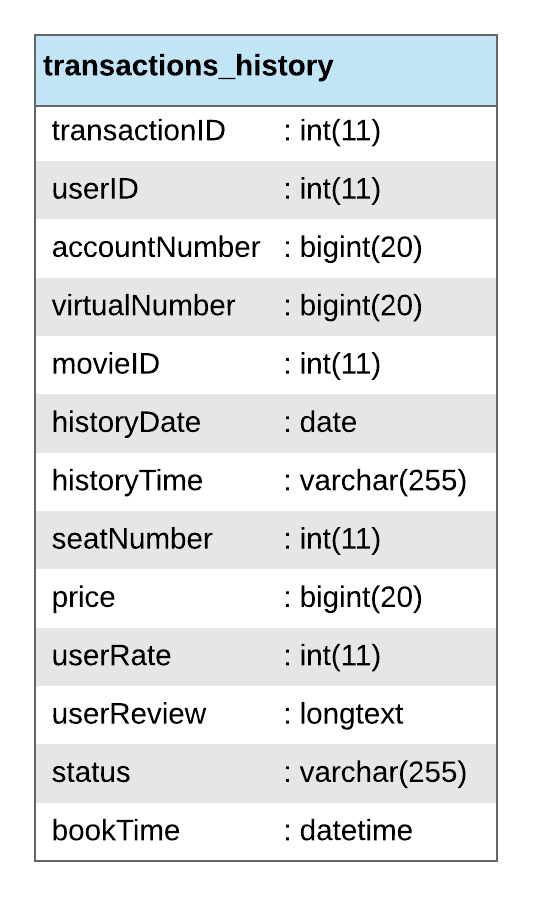

<h1 align="center">
    <b>
        <br>
        # Tugas Besar 2 IF3110 Pengembangan Aplikasi Berbasis Web / IF3159 Dasar Pembangunan Perangakat Lunak
        <br>
    </b>
</h1>

<h2 align="center">
    <b>
        <br>
        Web Service Transactions
        <br>
        <br>
    </b>
</h2>

## Deskripsi Singkat
Web service transaksi dibangun di atas Node.js dengan mengimplementasikan protokol ​REST​. ​Web service ini digunakan oleh Aplikasi Engima untuk mengatasi semua transaksi tiket film Engima.

Layanan yang disediakan oleh ​web service ​ini adalah:
1. Menambah transaksi baru dengan status “Pending”. Input yang diberikan adalah id pengguna, id film, kursi yang dipilih, dan nomor akun virtual yang menjadi tujuan pembayaran. Layanan mengembalikan id transaksi.

2. Mengubah status suatu transaksi menjadi status “Success” atau “Cancelled”. Input yang diberikan adalah id transaksi.

3. Mengembalikan seluruh data transaksi pembelian film seorang pengguna Engima.

Beberapa dependencies tambahan yang dibutuhkan oleh aplikasi Bank Pro:
1. body parser <br>
```npm install --save body-parser```
2. cors <br>
```npm install --save cors```
3. express <br>
```npm install --save express```
4. mysql <br>
```npm install --save mysql```

Cara menjalankan:

| local                                                                 |
|:----------------------------------------------------------------------|
| ketikan ```node server.js``` pada direktori src web service transaksi |

| AWS EC2                                                               |
|:----------------------------------------------------------------------|
| ketikan ```http://3.83.91.13:3500/``` pada web browser                |

## Basis Data Web Service


| Nomor | Relasi               | Penjelasan                                                                        |
|:-----:|:---------------------|:----------------------------------------------------------------------------------|
| 1     | transactions_history | Relasi yang berisi data transaksi pengguna Engima (terdiri dari id transaksi, id pengguna, nomor akun pengguna, nomor virtual account tujuan, id film, tanggal jadwal film, waktu jadwal film, nomor kursi, harga tiket, rating pengguna, review pengguna, status transaksi dan waktu pemesanan tiket)                  |

* Status sebuah transaksi tiket dikategorikan sebagai berikut:<br>1. Pending​: tiket belum dibayar namun belum lewat dari masa berlaku transaksi.<br>2. Cancelled​: tiket belum dibayar dan sudah lewat dari masa berlaku transaksi. Kursi yang dipesan pada transaksi dengan status ​cancelled menjadi tersedia kembali.<br>3. Success​: tiket sudah dibayar sebelum masa berlaku transaksi.

<br>

## Pembagian Tugas

### CI/CD
| Number | Feature                | Assignment |
|:------:|:-----------------------|:-----------|
| 1.     | Linting                | 13517137   |
| 2.     | Deployment to AWS EC2  | 13517137   |

<p align="center">
    <b>
        <br>
        <font size="6">
            About
        </font>
    </b>
</p>

<p align="center">
    <b>
        IF3110-Pengembangan Aplikasi Berbasis Web - 2019
        <br>
        Teknik Informatika 2017
        <br>
        <br>
        13517137 - Vincent Budianto
    </b>
</p>